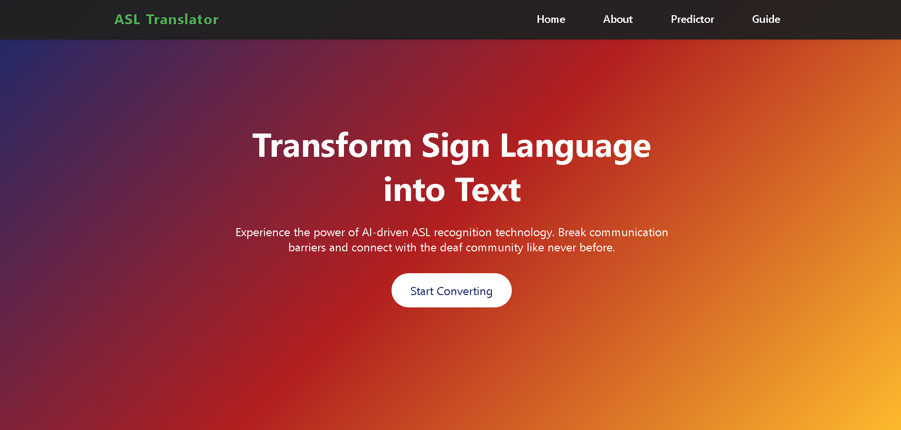

#  ASL Gesture Recognition AI ✋🔤

> **Empowering Communication Through AI | Helping the Deaf and Mute Community**

---

## 🧠 Overview

**HOPE** is an AI-based system designed to recognize hand gestures from the **American Sign Language (ASL)** and convert them into **text or speech** in real-time. Using machine learning and computer vision, it bridges the communication gap between the deaf/mute community and the hearing world.

---

## 🌟 Key Features

- ✋ **ASL Hand Gesture Detection**
- 🧠 **Deep Learning-Based Recognition (LSTM/MediaPipe)**
- 🗣️ **Text and Voice Output**
- 💡 **Real-Time Prediction Interface**
- 🖥️ **Web-based UI using Flask**

---

## 🔧 Tech Stack

| Component       | Technology Used         |
|----------------|--------------------------|
| Language        | Python                   |
| ML Framework    | TensorFlow / Keras       |
| Vision Model    | MediaPipe Hand Tracking  |
| UI Framework    | Flask, HTML/CSS          |
| Others          | Label Encoder, NumPy     |

---

## 🎯 Objective

> To assist individuals with hearing or speaking disabilities by enabling computers to **understand ASL hand gestures** and translate them into a **readable or audible format** using AI.

---

## 📸 Visual Representation

---

## 🚀 How It Works

1. **User shows a hand sign** in front of the webcam.
2. **MediaPipe** detects and extracts hand landmarks.
3. **Trained AI model (LSTM)** classifies the gesture.
4. **Output is displayed** on-screen as text and/or converted to speech.

---

## 📦 Project Structure

project-root/
│
├── model/ # Trained model (hope.keras)
├── static/ # CSS, JS, and images
├── templates/ # HTML files
├── app.py # Flask backend
├── utils/ # Helper functions
├── label_encoder.pkl # Encoded ASL labels
├── README.md # This file
└── requirements.txt # Python dependencies

---

## 📈 Future Enhancements

- ✨ Add full **sentence prediction**
- 🌍 Support **multiple sign languages**
- 📱 Build a mobile app version
- 🧪 Improve model accuracy with more data

---

## 🙌 Acknowledgments

- American Sign Language community
- TensorFlow & MediaPipe developers
- OpenCV & Python ML ecosystem

---

## 🤝 Let’s Connect!

> Created by **Brijesh Kumar** – Passionate about AI & Accessibility  
> Feel free to fork, star ⭐ the project, and contribute!
